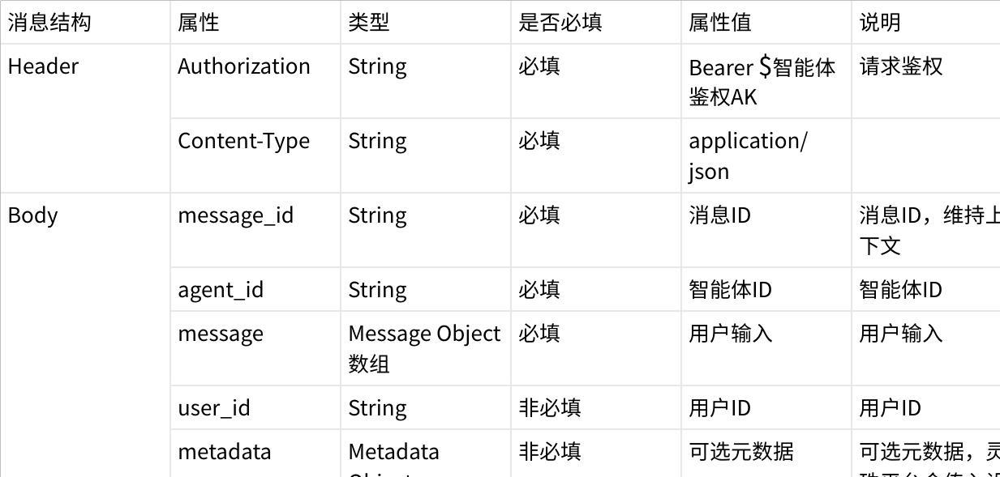
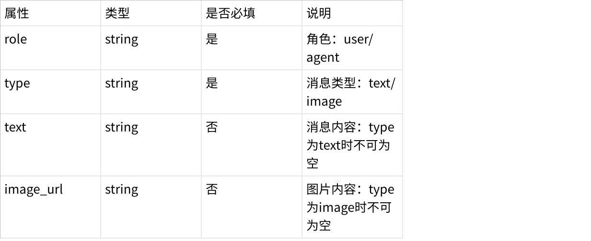
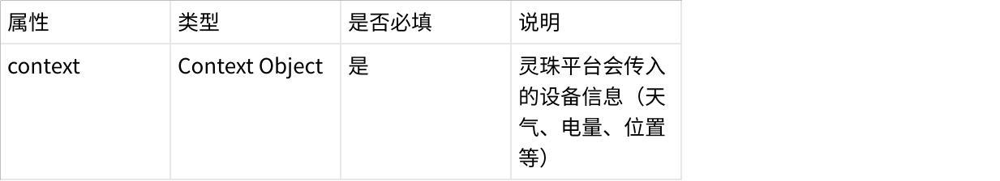
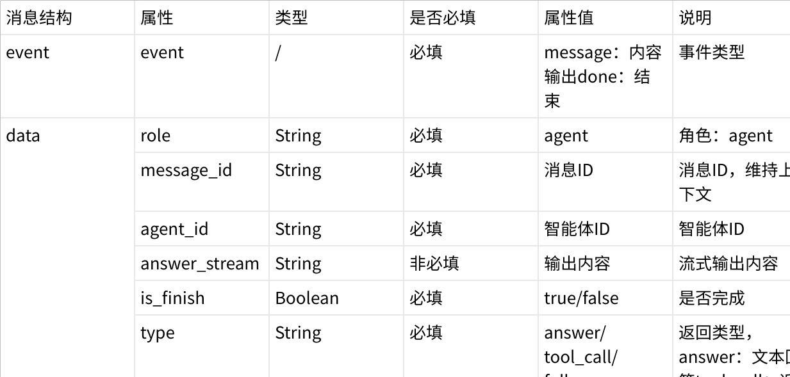
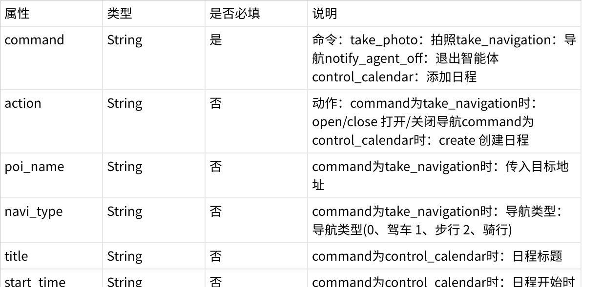

本文档来自《灵珠接入三方智能体协议》原始文档内容，主要以表格形式定义字段，以下以图片形式保留原始结构。

## 三方智能体 SSE 接口协议请求协议



## Message Object



## Metadata Object



## Context Object


## 请求示例输出协议



## Tool Object



## 输出示例（SSE）

```
event:message
data:{"role":"agent","type":"answer","answer_stream":"helfen","message_id":"7597792895776587776","is_finish":false}
```
